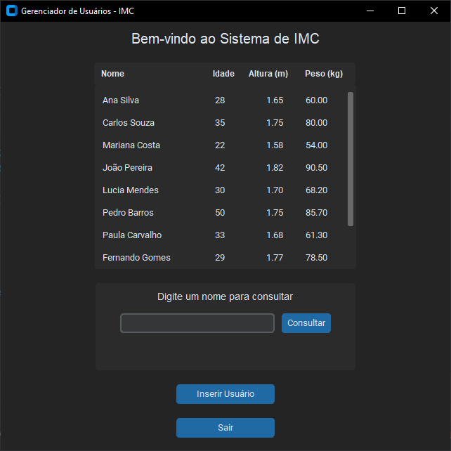

# Calcula IMC 📊

O Calcula IMC é uma aplicação desenvolvida em Python com interface gráfica, que permite gerenciar usuários e calcular o Índice de Massa Corporal (IMC) de forma prática e intuitiva. A aplicação utiliza SQLite3 como banco de dados e CustomTkinter para a interface gráfica.

## 📋 Funcionalidades
- **Cadastro de Usuários:** Insira informações como nome, idade, altura e peso.
- **Consulta de IMC:** Realize consultas do IMC por nome e veja a classificação de acordo com os padrões de saúde.
- **Visualização de Usuários:** Exiba uma tabela com todos os usuários cadastrados e suas informações.
- **Interface Intuitiva:** Interface gráfica amigável e personalizável , adaptada para diferentes modos claro e escuro.
- **Armazenamento Local:** Persistência de dados usando o banco de dados SQLite.

## 🛠️ Tecnologias Utilizadas
- Python 🐍
- SQLite3 (banco de dados local)
- CustomTkinter (interface gráfica)

## ⚙️ Como Executar o Projeto

### Pré-requisitos
Certifique-se de ter o **Python 3.10** ou superior instalado e as dependências necessárias. 

### 1. Clone o repositório:
```bash
git clone https://github.com/kalebeccs/calcula-imc-ipluso.git
cd calcula-imc-ipluso
```

### 2. Crie um ambiente virtual:
```bash
python -m venv venv
source venv/bin/activate  # No Windows, use: venv\Scripts\activate
```

### 3. Instale as dependências:
```bash
pip install -r requirements.txt
```

### 4. Execute a aplicação:
```bash
python src/app.py
```

## 🗂️ Estrutura do Projeto

```plaintext
📁 calcula-imc-ipluso
├── 📂 assets                 # Recursos visuais
├── 📂 db
│   ├── db.py                 # Funções para manipulação do banco de dados
├── 📂 src
│   ├── app.py                # Arquivo principal da aplicação
│   ├── interface.py          # Funções da interface gráfica
│   ├── users.py              # Gerenciamento de usuários
│   └── utils.py              # Funções auxiliares
├── README.md                 # Documentação do projeto
└── requirements.txt          # Dependências do projeto
```

## 📊 Cálculo de IMC

O cálculo de IMC é realizado pela fórmula:
> IMC = Peso (kg) / [Altura (m)]²

### Classificação do IMC:
| Faixa de IMC         | Classificação            |
|-----------------------|--------------------------|
| Abaixo de 18,5       | Abaixo do peso           |
| 18,5 – 24,9          | Peso normal             |
| 25,0 – 29,9          | Sobrepeso               |
| 30,0 – 34,9          | Obesidade Grau I        |
| 35,0 – 39,9          | Obesidade Grau II       |
| Acima de 40,0        | Obesidade Grau III      |

## Preview

